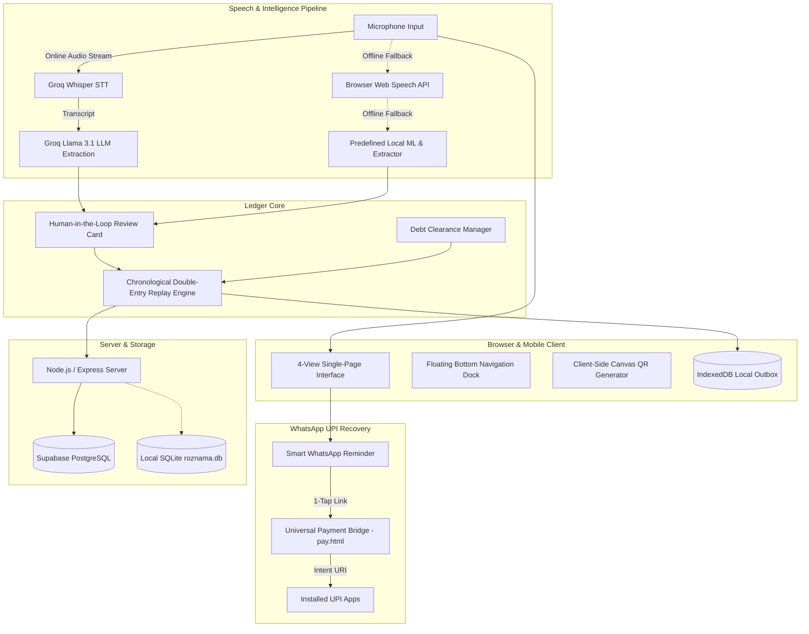

# RozNama (रोज़नामा)
### Multilingual Voice-First Ledger and UPI Payment Recovery for Kirana Stores

[](LICENSE)
[](https://nodejs.org/)
[](https://groq.com)
[](https://supabase.com)
[](#deployment-and-quick-start)

> **Demo Video & Screenshots**: [Watch Demo & View Application Screenshots](https://drive.google.com/drive/folders/1B0ezKUgWw_ST-dtBQf0aOv2TApwdOVvj?usp=sharing)

---

## Overview

Across India, over 15 million micro-retailers and Kirana storekeepers power local neighborhood commerce. Yet over 80% of daily credit transactions remain recorded on physical paper notebooks (*khata*). Traditional digital ledger mobile apps fail local storekeepers due to three persistent challenges:

1. **Typing Friction**: Busy store owners working behind physical counters cannot spend time typing item names and figures on small keyboards.
2. **Ignored SMS Reminders**: Legacy apps charge recurring vendor fees for automated SMS payment reminders that customers treat as spam or overlook.
3. **Broken In-App Payment Links**: Raw `upi://` deep-links fail when tapped inside WhatsApp's in-app sandbox on Android and iOS devices, blocking customer payments.

**RozNama** solves these challenges with a voice-first, 4-view single-page application. Storekeepers speak naturally in **Hindi, Hinglish, or English** to log transactions in seconds. RozNama combines high-accuracy Groq Cloud AI with a local offline ML classifier, an immutable chronological double-entry replay engine, client-side canvas QR rendering, and a universal 1-tap WhatsApp payment gateway with 0% platform commission and instant direct-to-bank settlement.

---

## Core Capabilities

### 1. Hybrid Voice & Entity Extraction Engine
RozNama adapts dynamically to the storekeeper's network status:
* **Online Mode (Default)**: Audio voice entries are transcribed using **Groq Whisper** (`whisper-large-v3-turbo`) and structured using **Groq Llama 3.1** (`llama-3.1-8b-instant`). The model extracts customer names, received cash (*Jama*), pending credit balance (*Udhaar*), items, retail category, and relative payment due dates in sub-second response times.
* **Offline Fallback Engine**: If internet connectivity drops, voice speech is captured via the browser's built-in Web Speech API or typed directly into the input bar. A local feature-weighted machine learning classifier categorizes the transaction into 8 retail domains (*Groceries & Ration, Dairy & Milk Products, Cooking Oils & Ghee, Spices & Masala, Snacks & Beverages, Toiletries & Cleaning, Personal Care & Cosmetics, General Kirana*) and extracts vernacular financial amounts without external network calls.
* **Human-in-the-Loop Review**: Extracted details are displayed in an interactive review card before saving, giving the vendor full control to confirm or adjust values.

### 2. Universal WhatsApp Smart Reminders & 1-Tap UPI Gateway
* **WhatsApp Sandbox Bypass**: When customers click raw `upi://` links inside WhatsApp, the embedded webview blocks the request. RozNama routes payment links through a universal bridge (`pay.html`) using the Android Intent scheme (`intent://pay?...#Intent;scheme=upi;end`), launching the customer's preferred UPI app (Google Pay, PhonePe, Paytm, BHIM, Cred) with the storekeeper's VPA, verified name, and exact amount pre-filled.
* **Offline Client-Side Canvas QR**: Scannable UPI QR codes are rendered strictly in-browser using HTML5 Canvas (`qrcode.min.js`). No customer names, phone numbers, or balances are ever transmitted to third-party QR generation APIs.
* **Pre-Curated Message Templates**: Vendors can trigger friendly payment reminders, due-date notices, or overdue follow-ups with a single click.
* **Zero Platform Fees**: All payments settle directly peer-to-peer into the merchant's bank account with zero intermediate holding fees.

### 3. Chronological Double-Entry Ledger Replay Engine
* **Event-Sourced Ledger**: Instead of storing mutable balance totals that risk state-drift and overwrite bugs during cloud synchronization, RozNama maintains an immutable ledger stream.
* **Consistent State Calculation**: Debits and credit settlements are replayed chronologically from oldest to newest. Cleared debts remain cleared across page refreshes, tab changes, and Supabase cloud syncs.

### 4. 4-View Single-Page Interface
An elevated bottom navigation dock allows fluid switching between four core store views with zero page reloads:
* **Home View**: Voice recording hero mic, real-time audio waveform, daily cash and udhaar summaries, overdue account counters, and recent activity log.
* **Khata Directory**: Customer credit directory with live search by name or phone, 5 sorting orders (Highest Udhaar, Nearest Due, Lowest Udhaar, A-Z, Recently Active), 4 filter chips (All, Pending, Due Today, Settled), direct phone calling, WhatsApp reminders, and 1-tap partial/full debt clearance.
* **Ledger History**: Complete chronological audit trail of all transactions with customer details, item badges, cash vs credit breakdowns, and filterable history.
* **Store Profile & Counter QR**: Business profile settings, custom UPI VPA management with quick-handle chips (`@upi`, `@okhdfcbank`, `@paytm`, etc.), live printable Shop Counter Standee QR, and Supabase cloud sync status.

---

## Architecture



---

## Deployment and Quick Start

RozNama is preconfigured for **Local Deployment by default** (`http://localhost:5000`) and is completely ready for **Vercel Cloud Serverless Deployment** without any manual configuration changes.

### A. Local Deployment (Default)

RozNama runs locally out of the box using an embedded SQLite database (`roznama.db`) and requires no mandatory cloud setup to evaluate.

#### Prerequisites
* Node.js v18.0.0 or higher
* npm v9.0.0 or higher
* Modern web browser (Chrome, Edge, Brave, or Safari)

#### Setup Steps
```bash
# 1. Clone the repository
git clone https://github.com/your-username/RozNama.git
cd RozNama

# 2. Install dependencies
npm install

# 3. Start the application
npm start
```

The application starts immediately on:
```text
RozNama Server running on http://localhost:5000 [Mode: LOCAL]
```
Open **`http://localhost:5000`** in your browser.

---

## Project Structure

```
RozNama/
├── index.html                  # 4-View single-page application structure
├── style.css                   # Glassmorphism design system and responsive layout
├── pay.html                    # Universal 1-tap UPI payment gateway
├── roznama.config.js           # Master configuration (Local default, Vercel ready)
├── vercel.json                 # Vercel serverless routing configuration
├── package.json                # Project dependencies and startup scripts
├── .env.example                # Sample environment variables template
├── README.md                   # Project documentation and architecture guide
├── api/
│   └── index.js                # Vercel serverless function entry point
├── js/
│   ├── frontend/
│   │   ├── qrcode.min.js       # Client-side offline QR generator
│   │   ├── modals.js           # Popup modals (Clear Due, Phone, UPI, WhatsApp, Reconnect)
│   │   ├── ui.js               # 4-view SPA controller, stat counters, and table renderers
│   │   ├── auth.js             # Vendor session and JWT token management
│   │   └── speech.js           # Voice recording and transcription handlers
│   └── backend/
│       ├── app.js              # Application bootstrap and event listeners
│       ├── classifier.js       # Predefined 8-category ML taxonomy and keyword scoring
│       ├── store.js            # IndexedDB outbox queue and local persistence
│       ├── ledger.js           # Transaction handlers and balance calculations
│       ├── parser.js           # Groq Cloud AI and offline fallback entity extraction
│       └── demo-data.js        # Initial seed transactions and customer profiles
└── server/
    ├── server.js               # Express application entry point
    ├── db.js                   # Unified database client (Supabase PostgreSQL + SQLite)
    ├── middleware/
    │   └── auth.js             # JWT authentication middleware
    └── routes/
        ├── auth.js             # Merchant authentication routes
        ├── ledger.js           # Cloud transaction synchronization routes
        └── ai.js               # Groq Whisper and LLM extraction routes
```

---

## Security and Privacy

* **Direct Settlement**: RozNama does not collect or hold vendor funds. All UPI transactions execute directly peer-to-peer via official NPCI banking rails.
* **Isolated Vendor Data**: Store records are strictly partitioned by tenant ID at both the database level (PostgreSQL / SQLite) and API layer (JWT authentication).
* **Client-Side QR Generation**: UPI dynamic QR codes are rendered strictly in-browser via canvas, eliminating exposure of merchant VPAs or customer transaction amounts to third-party QR generation APIs.

---

## License

This project is licensed under the [MIT License](LICENSE).
