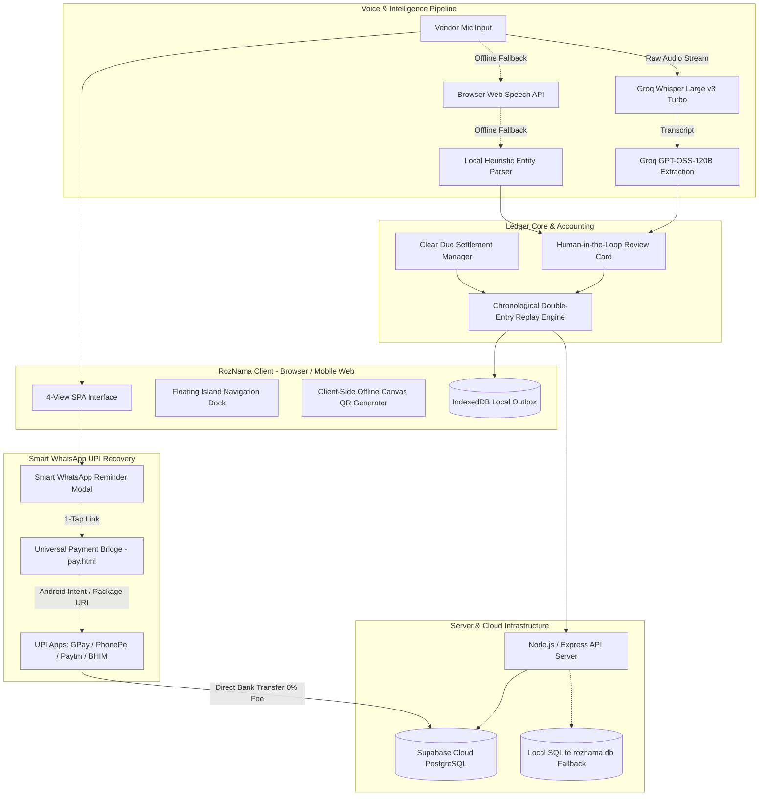

# RozNama (रोज़नामा) 🎙️💳
### *The Next-Gen Multilingual Voice-First Ledger & UPI Payment Recovery Engine for Bharat's Kirana Stores*

[](LICENSE)
[](https://groq.com)
[](https://groq.com)
[](https://supabase.com)
[](#offline-first-architecture)
[](#smart-whatsapp-reminder-model)

---

## 🇮🇳 The Problem & Vision

Across India, over **15 million micro-retailers and Kirana storekeepers** power local neighborhood commerce. Yet, **over 80% of daily transactions remain stuck on paper notebooks (*khata*)**. Traditional digital ledger applications fail local storekeepers for three fundamental reasons:
1. **Typing Friction**: Store owners are busy behind physical counters with dusty hands; manual typing on keyboards is frustrating and slow.
2. **Ignored SMS Reminders**: Legacy apps charge vendors recurring fees for automated SMS payment reminders that customers dismiss as spam.
3. **Flawed Payment Links**: Raw `upi://` deep-links fail when opened inside WhatsApp's in-app sandbox on Android/iOS, blocking customer payments.

**RozNama** changes the game. It is a **voice-first, 4-view single-page application** that lets vendors manage their store entirely by speaking colloquially in **Hindi, Hinglish, or English**. With an **iOS-inspired floating navigation dock**, a **chronological double-entry replay engine**, and a **100% offline canvas QR & universal WhatsApp payment landing page**, RozNama transforms debt recovery with **0% commission and instant direct-to-bank settlement**.

---

## 🌟 Standout Signature Features

```
┌───────────────────────────────────────────────────────────────────────────┐
│                           ROZNAMA 4-VIEW ECOSYSTEM                        │
├────────────────────┬────────────────────┬────────────────┬────────────────┤
│   🏠 VIEW 1: HOME  │  👥 VIEW 2: KHATA  │ 📜 VIEW 3: LEDGER│ 👤 VIEW 4: STORE │
│  • Voice Hero Mic  │ • Credit Directory │ • Itemized Log │ • Store Profile│
│  • Groq Whisper v3 │ • Search & Sort    │ • Search Filter│ • UPI VPA Hub  │
│  • Daily Stat Cards│ • Status Chips     │ • Full History │ • Standee QR   │
│  • Quick Activity  │ • Clear Due & Pay  │ • Cash vs Debt │ • Cloud Backup │
└────────────────────┴────────────────────┴────────────────┴────────────────┘
                               ▲
                               │
               [ 🏝️ FLOATING NAVIGATION ISLAND DOCK ]
                  (Zero Page Reloads • Always Smooth)
```

---

### 1. 🚀 Universal WhatsApp Smart Reminder & 1-Tap UPI Gateway
*Our Signature Payment Recovery Breakthrough*

Legacy ledger apps send generic SMS reminders with high bounce rates. RozNama integrates directly into WhatsApp with an intelligent payment link system:
* **The WhatsApp Sandbox Bypass**: When customers tap raw `upi://` links inside WhatsApp chat bubbles, Android blocks them with *"No app found to open link"*. RozNama solves this by generating a universal payment bridge (`pay.html`) featuring an **Android Intent Scheme (`intent://pay?...#Intent;scheme=upi;end`)**.
* **Universal 1-Tap Payment Link**: One tap on the WhatsApp payment link automatically launches the customer's installed UPI app (**Google Pay, PhonePe, Paytm, BHIM, Cred**) with the storekeeper's VPA, verified merchant name, and exact outstanding balance pre-populated.
* **100% Client-Side Offline Canvas QR Code**: Powered by a bundled pure JavaScript QR engine (`qrcode.min.js`), scannable UPI dynamic QR codes are rendered directly onto HTML5 canvases **100% locally and offline without sending sensitive financial data to third-party QR generation APIs**.
* **Pre-Curated Localized Message Templates**: Choose between **🌟 Friendly Reminder**, **📅 Payment Due Date**, or **⚡ Clear Overdue** with a single tap.
* **0% Platform Cut & Instant Settlement**: Payments go directly from the customer's bank account to the storekeeper's UPI VPA with zero middlemen, no gateway holding fees, and instant settlement.

---

### 2. 🏝️ iOS-Inspired Floating Navigation Island (4-View Hub)
Designed for fluid, uninterrupted interaction behind the counter:
* **Elevated Floating Pill Dock**: Floats 22px above the screen bottom with translucent frosted glassmorphism (`backdrop-filter: blur(20px)`), delicate borders, and ambient drop shadows.
* **Dynamic Active State**: Active tabs feature elevated, gradient-glowing badges (`linear-gradient(135deg, #F59E0B, #D4B574)`) with micro-animations.
* **Zero Page Reloads**: Switching between tabs occurs instantaneously in-memory, preserving ongoing voice recordings, temporary draft cards, and local IndexedDB state.
* **Universal Responsiveness**: Seamlessly scales from compact Android smartphones and iPhones to desktop monitor displays.

---

### 3. 👥 Customer Khata Directory with Multi-Criteria Intelligence
A customer credit directory built for quick retrieval and debt prioritization:
* **Smart Search**: Real-time filtering by customer name or telephone number.
* **Multi-Criteria Sorting Engine**:
  * ₹ **Highest Udhaar First** — Prioritize maximum cash recoveries.
  * 📅 **Nearest Due Date** — Focus on urgent payment promises.
  * ₹ **Lowest Udhaar First** — Quickly clear small balances.
  * 🔤 **Alphabetical (A–Z)** — Standard directory indexing.
  * ⚡ **Recently Active** — Review recent customer activity.
* **One-Tap Status Filter Chips**:
  * **All Accounts** (with live account count badge)
  * **Pending Udhaar** (accounts with active outstanding credit)
  * **Due Today / Overdue** (accounts requiring immediate payment reminders)
  * **Settled / Nil** (accounts with zero due)
* **1-Tap Modal Actions**: Click **Clear Due** to record incoming cash payments, **💬 WhatsApp** to launch smart reminder templates, or **📞 Call** to dial directly.

---

### 4. 🧮 Chronological Double-Entry Ledger Replay Engine
Prevents balance corruption and synchronization overwrites:
* **The Challenge**: Traditional mobile web apps suffer from state-drift when transactions are synced with the cloud, often resetting cleared debts back to their original balance.
* **The RozNama Engine**: Uses an immutable event-stream model. All transactions (purchases and debt clearance settlements) are chronologically ordered from oldest to newest. The engine replays debits and credits dynamically, subtracting settlements from outstanding debt and updating payment due dates.
* **Result**: Once an amount is cleared, it stays cleared across page reloads, tab navigation, and Supabase cloud syncs.

---

### 5. 🎙️ Dual-Engine Voice AI Pipeline (Online Groq + Offline Web Speech)
* **Online Ultra-Low Latency**: Streams raw audio to **Groq Whisper Large v3 Turbo (`whisper-large-v3-turbo`)**, achieving >95% transcription accuracy on regional Indian accents, noisy market environments, and mixed Hindi/English phrases (*"Ramesh ne 300 cash diya aur 150 kal dega"*).
* **Context-Aware Entity Extraction**: Powered by **Groq LLM (`openai/gpt-oss-120b`)** in strict JSON mode to extract:
  * Customer Name (*Ramesh Sharma*)
  * Cash Received (*₹300 Jama Cash*)
  * Credit Given (*₹150 Udhaar*)
  * Items Purchased (*Milk / Ration*)
  * Intelligent Relative Due Date (*"kal" → Tomorrow's date; "agle hafte" → 7 days out*)
* **Human-in-the-Loop Safeguard**: Before anything is committed to the ledger, an interactive review card appears, allowing the vendor to verify or adjust figures with a single tap.
* **Offline Fallback**: Automatically degrades gracefully to the local browser Web Speech API and regex heuristic parser if the vendor loses internet connectivity.

---

### 6. ☁️ Enterprise Multi-Store Cloud Isolation (Supabase PostgreSQL + SQLite)
* **Multi-Tenant Security**: Every storekeeper gets a dedicated, isolated account secured by JSON Web Tokens (JWT) and bcrypt password hashing.
* **Cloud + Local Resilience**: Backed by **Supabase Cloud PostgreSQL** with automatic offline fallback to **local SQLite (`roznama.db`)** and client-side **IndexedDB**.
* **Offline Outbox Queue**: Entries made without internet are queued in IndexedDB and automatically pushed to the cloud once connectivity resumes.

---

## 🏛️ System Architecture



---

## 🧭 Deep Dive: The 4 Distinct Views

| View | Icon | Purpose | Key Capabilities |
| :--- | :---: | :--- | :--- |
| **Home** | 🏠 | **Daily Voice Ledger** | Voice hero microphone, live waveform visualizer, manual text fallback, today's cash collected, total udhaar pending, active customer count, overdue count, and quick today's activity ledger. |
| **Khata** | 👥 | **Customer Directory** | Complete customer credit list, live search by name/phone, 5 sorting filters (highest udhaar, lowest udhaar, nearest due, alphabetical, recent), 4 filter chips (All, Pending, Due Today, Settled), customer avatars, due badges, 1-tap WhatsApp reminder, Call, and Clear Due settlement. |
| **History** | 📜 | **Transaction Ledger** | Chronological record of all cash, credit, and debt settlement entries with customer names, timestamps, item badges, jama cash, udhaar balance, and live search filtering. |
| **Store** | 👤 | **Store Profile & Settings** | Manage store identity (Shop Name, Owner Name, Registered Phone), Store UPI VPA management with quick-handle chips (`@upi`, `@okhdfcbank`, `@paytm`, etc.), live scannable Shop Counter Standee QR canvas, Supabase sync status, and account logout. |

---

## ⚡ Quick Start Guide

### 1. Prerequisites
* **Node.js**: v18.0.0 or higher ([Download Node.js](https://nodejs.org/))
* **npm**: v9.0.0 or higher
* A modern web browser (Google Chrome, Microsoft Edge, Safari, or Brave)

### 2. Installation
Clone the repository and install server dependencies:
```bash
git clone https://github.com/<your-username>/RozNama.git
cd RozNama/server
npm install
```

### 3. Environment Configuration
Create a `.env` file inside the `server/` directory:
```env
PORT=5000
JWT_SECRET=your_super_secret_jwt_key_here
GROQ_API_KEY=your_groq_api_key_here
SUPABASE_URL=https://your-project.supabase.co
SUPABASE_KEY=your_supabase_anon_key_here
```
> **Security Note**: The `.env` file is automatically ignored by Git to ensure credentials are never pushed to public repositories.

### 4. Running Locally
Start the server from the `server/` directory:
```bash
node server.js
```
The server will boot and connect to Supabase Cloud:
```
⚡ Connected to Supabase Cloud Database at: https://...
🚀 RozNama Server running on http://localhost:5000
```
Open your browser and navigate to:
👉 **`http://localhost:5000`**

---

## 📂 Project Directory Structure

```
RozNama/
├── index.html                  # 4-View SPA HTML structure & Floating Navigation Island
├── style.css                   # iOS glassmorphism design system, elevated badges & responsive styles
├── pay.html                    # Universal 1-tap UPI payment gateway (Android intent & deep links)
├── README.md                   # Comprehensive project documentation & architecture guide
├── js/
│   ├── frontend/
│   │   ├── qrcode.min.js       # Zero-dependency offline client-side QR generator (window.QRCode)
│   │   ├── ui.js               # Multi-view switcher, customer directory, sorting & reminder modals
│   │   ├── auth.js             # Vendor session manager, JWT handler & landing page controller
│   │   └── speech.js           # MediaRecorder audio streaming & browser Web Speech engine
│   └── backend/
│       ├── app.js              # Application bootstrap & DOM event listeners
│       ├── store.js            # IndexedDB outbox queue & chronological double-entry replay engine
│       ├── ledger.js           # Transaction processing & speech feedback triggers
│       ├── parser.js           # Groq LLM entity extraction & offline regex fallback
│       └── demo-data.js        # Voice recognition helper phrases & initial test seeds
└── server/
    ├── server.js               # Express application entry point & static file server
    ├── db.js                   # Unified Supabase Cloud client with local SQLite fallback
    ├── middleware/
    │   └── auth.js             # Bearer JWT token verification middleware
    └── routes/
        ├── auth.js             # Vendor registration, login & session verification
        ├── ledger.js           # Cloud transaction sync & itemized history endpoints
        └── ai.js               # Groq Whisper STT & LLM entity extraction proxies
```

---

## 🛡️ Security, Privacy & Ethics

* **Zero Financial Data Leakage**: RozNama does not act as a payment custodian or intermediary. All UPI transactions settle directly peer-to-peer (P2P/P2M) via NPCI's official banking protocols.
* **Strict Tenant Isolation**: Storekeeper records are partitioned by unique vendor IDs at both the database level (PostgreSQL / SQLite) and API token level (JWT).
* **Pure Offline Canvas Generation**: UPI QR codes are rendered strictly client-side on HTML5 canvases without sending customer names, phone numbers, or due amounts to external third-party QR generation web services.

---

## 📜 License
This project is licensed under the **MIT License**. Created with ❤️ for Bharat storekeepers, Kirana retailers, and micro-merchants across India.
